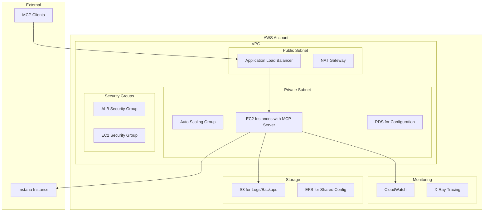
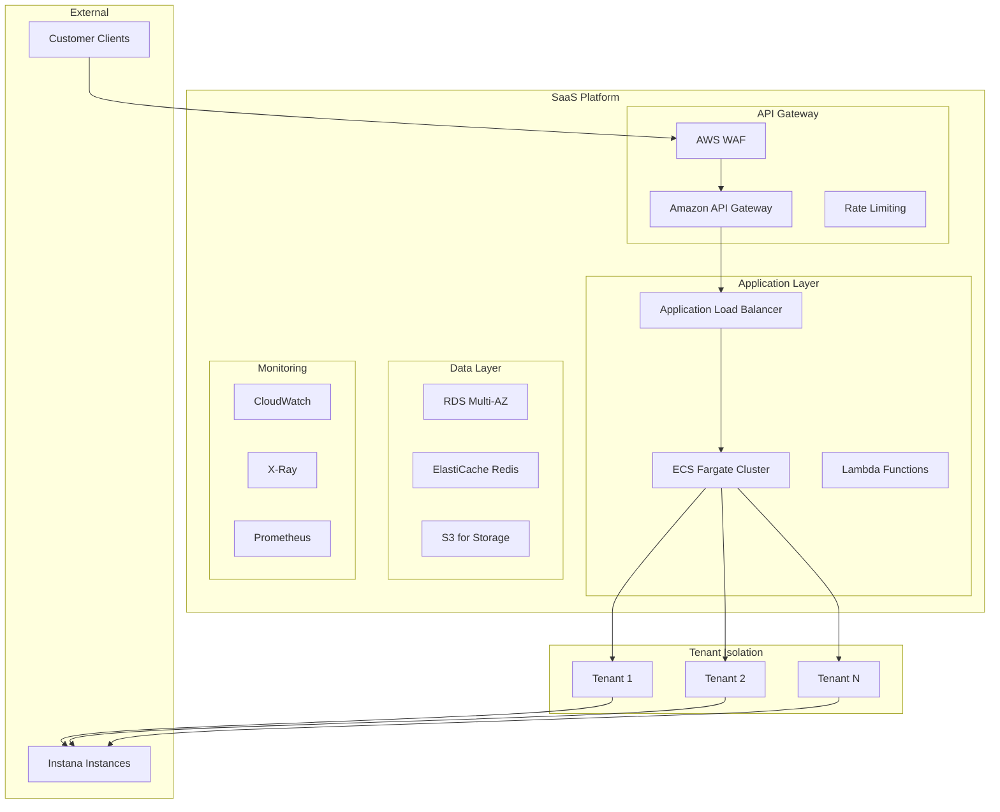

# MCP Instana Server - AWS Marketplace Integration Proposal

## Executive Summary

This document outlines comprehensive integration strategies for deploying the MCP Instana Server across five distinct AWS Marketplace product categories. The MCP Instana Server is a Model Context Protocol (MCP) server that provides seamless integration between AI agents and IBM Instana's observability platform, enabling real-time monitoring, alerting, and analysis capabilities.

## Product Overview

### MCP Instana Server Capabilities
- **Real-time Observability**: Application, infrastructure, and website monitoring
- **AI-Native Integration**: Direct integration with Claude Desktop, GitHub Copilot, and custom MCP clients
- **Multi-Transport Support**: HTTP and stdio transport modes
- **Comprehensive Tool Suite**: 50+ tools across infrastructure, application, events, and website monitoring
- **Flexible Authentication**: Header-based and environment variable authentication
- **Container-Ready**: Docker support with multi-stage builds

---

## 1. AMI-Based Products in AWS Marketplace

### 1.1 Product: Instana MCP Server AMI

#### Design Specifications

**Base AMI Configuration:**
- **OS**: Amazon Linux 2023 or Ubuntu 22.04 LTS
- **Instance Types**: t3.medium (2 vCPU, 4 GB RAM) minimum
- **Storage**: 20 GB EBS gp3 volume
- **Architecture**: x86_64

**Pre-installed Components:**
```yaml
System Packages:
  - Python 3.11+
  - Docker CE
  - Git
  - curl, wget, jq
  - AWS CLI v2

Python Environment:
  - uv package manager
  - mcp-instana package
  - All dependencies from pyproject.toml

Configuration:
  - Systemd service for auto-start
  - Cloud-init scripts for AWS integration
  - IAM role configuration templates
  - Security group templates
```

**AMI Features:**
- **Auto-scaling Ready**: CloudFormation templates for ASG deployment
- **Health Checks**: Built-in health monitoring endpoints
- **Logging**: CloudWatch Logs integration
- **Security**: Hardened OS configuration with minimal attack surface
- **Updates**: Automated security updates via CloudFormation

#### Deployment Architecture



#### Pricing Model
- **Base AMI**: $0.50/hour per instance
- **Data Transfer**: $0.09/GB for outbound data
- **Storage**: Standard EBS pricing
- **Support**: Basic support included, premium support available

#### Customer Onboarding
1. **Launch Wizard**: Step-by-step EC2 launch with pre-configured parameters
2. **Quick Start**: One-click deployment with CloudFormation
3. **Configuration Guide**: Automated setup for Instana credentials
4. **Testing Suite**: Built-in validation tools

---

## 2. Container-Based Products on AWS Marketplace

### 2.1 Product: Instana MCP Server Container

#### Design Specifications

**Container Image:**
```dockerfile
# Multi-stage build optimized for production
FROM python:3.11-slim AS builder
# Build stage with all dependencies
FROM python:3.11-slim AS runtime
# Minimal runtime with security hardening
```

**Container Features:**
- **Size**: < 200MB compressed
- **Security**: Non-root user, minimal attack surface
- **Health Checks**: Built-in readiness and liveness probes
- **Logging**: Structured JSON logging for CloudWatch
- **Metrics**: Prometheus-compatible metrics endpoint

#### Deployment Options

**Option A: Amazon ECS with Fargate**
```yaml
# ECS Task Definition
family: mcp-instana-server
networkMode: awsvpc
requiresCompatibilities: [FARGATE]
cpu: 512
memory: 1024
containerDefinitions:
  - name: mcp-instana
    image: instana/mcp-server:latest
    portMappings:
      - containerPort: 8080
    environment:
      - name: INSTANA_BASE_URL
        value: ${INSTANA_URL}
      - name: INSTANA_API_TOKEN
        valueFrom: secretsmanager
    healthCheck:
      command: ["CMD-SHELL", "curl -f http://localhost:8080/health || exit 1"]
```

**Option B: Amazon EKS**
```yaml
# Kubernetes Deployment
apiVersion: apps/v1
kind: Deployment
metadata:
  name: mcp-instana-server
spec:
  replicas: 3
  selector:
    matchLabels:
      app: mcp-instana-server
  template:
    spec:
      containers:
      - name: mcp-instana
        image: instana/mcp-server:latest
        ports:
        - containerPort: 8080
        env:
        - name: INSTANA_BASE_URL
          valueFrom:
            secretKeyRef:
              name: instana-secrets
              key: base-url
        resources:
          requests:
            memory: "512Mi"
            cpu: "250m"
          limits:
            memory: "1Gi"
            cpu: "500m"
```

#### Service Mesh Integration
- **AWS App Mesh**: Traffic management and observability
- **Istio**: Advanced traffic routing and security
- **Consul Connect**: Service discovery and configuration

#### Pricing Model
- **Container Image**: $0.25/hour per container
- **EKS Cluster**: Standard AWS EKS pricing
- **Fargate**: Pay-per-use based on vCPU and memory
- **Data Transfer**: Standard AWS data transfer pricing

---

## 3. Machine Learning Products in AWS Marketplace

### 3.1 Product: AI-Powered Observability Assistant

#### Design Specifications

**ML Integration:**
- **Anomaly Detection**: Built-in ML models for detecting unusual patterns
- **Predictive Analytics**: Forecasting based on historical data
- **Natural Language Processing**: Enhanced query understanding
- **Auto-remediation**: Intelligent response to common issues

**ML Components:**
```python
# ML Pipeline Architecture
class ObservabilityMLPipeline:
    def __init__(self):
        self.anomaly_detector = AnomalyDetector()
        self.forecaster = TimeSeriesForecaster()
        self.nlp_processor = NLPAnalyzer()
        self.recommendation_engine = RecommendationEngine()
    
    async def analyze_metrics(self, metrics_data):
        # Anomaly detection
        anomalies = await self.anomaly_detector.detect(metrics_data)
        
        # Forecasting
        forecast = await self.forecaster.predict(metrics_data)
        
        # Generate insights
        insights = await self.generate_insights(anomalies, forecast)
        
        return {
            "anomalies": anomalies,
            "forecast": forecast,
            "insights": insights,
            "recommendations": await self.recommendation_engine.suggest(insights)
        }
```

#### SageMaker Integration
```yaml
# SageMaker Endpoint Configuration
ModelEndpoint:
  Type: AWS::SageMaker::Model
  Properties:
    ModelName: instana-ml-model
    PrimaryContainer:
      Image: instana/mcp-ml:latest
      ModelDataUrl: s3://instana-models/ml-model.tar.gz
      Environment:
        INSTANA_API_URL: !Ref InstanaAPIURL
        ML_MODEL_PATH: /opt/ml/model

# SageMaker Endpoint
Endpoint:
  Type: AWS::SageMaker::Endpoint
  Properties:
    EndpointConfigName: !Ref ModelEndpointConfig
```

#### ML Features
- **AutoML**: Automated model selection and tuning
- **A/B Testing**: Model performance comparison
- **Feature Engineering**: Automatic feature extraction from metrics
- **Model Monitoring**: Drift detection and retraining triggers

#### Pricing Model
- **Base Service**: $1.00/hour per ML-enabled instance
- **SageMaker**: Pay-per-inference pricing
- **Data Processing**: $0.10/GB for ML data processing
- **Model Training**: $0.50/hour for training jobs

---

## 4. SaaS-Based Products in AWS Marketplace

### 4.1 Product: Instana MCP Server SaaS Platform

#### Design Specifications

**Multi-Tenant Architecture:**
```python
# Tenant Isolation
class TenantManager:
    def __init__(self):
        self.tenant_configs = {}
        self.tenant_instances = {}
    
    async def create_tenant(self, tenant_id, config):
        # Isolated configuration per tenant
        tenant_config = TenantConfig(
            instana_url=config['instana_url'],
            api_token=config['api_token'],
            features=config['features'],
            limits=config['limits']
        )
        
        # Create isolated MCP server instance
        server_instance = await self.create_server_instance(tenant_config)
        
        self.tenant_configs[tenant_id] = tenant_config
        self.tenant_instances[tenant_id] = server_instance
        
        return server_instance
```

**SaaS Features:**
- **Multi-tenancy**: Isolated instances per customer
- **API Gateway**: Centralized API management
- **Usage Analytics**: Detailed usage tracking and billing
- **White-labeling**: Custom branding options
- **SSO Integration**: SAML, OAuth2, and LDAP support

#### Infrastructure Architecture


#### Subscription Tiers
- **Starter**: $99/month - 1 tenant, 1M API calls
- **Professional**: $299/month - 5 tenants, 10M API calls
- **Enterprise**: $999/month - Unlimited tenants, 100M API calls
- **Custom**: Contact sales for enterprise pricing

#### Customer Portal
- **Dashboard**: Usage analytics and billing information
- **Configuration**: Self-service tenant configuration
- **Support**: Integrated ticketing system
- **Documentation**: Interactive API documentation

---

## 5. Professional Services Products in AWS Marketplace

### 5.1 Product: Instana MCP Implementation Services

#### Service Offerings

**Implementation Services:**
- **Architecture Review**: Assessment of current observability setup
- **Custom Integration**: Tailored MCP server configurations
- **Migration Services**: Moving from existing monitoring solutions
- **Training**: Team training on MCP and Instana integration

**Service Packages:**

**Package 1: Quick Start Implementation ($5,000)**
- 2-day implementation workshop
- Basic MCP server setup
- Integration with existing Instana instance
- Documentation and handover

**Package 2: Enterprise Implementation ($15,000)**
- 1-week comprehensive implementation
- Custom tool development
- Multi-environment setup (dev/staging/prod)
- Advanced monitoring and alerting configuration
- Team training (up to 10 people)

**Package 3: Custom Development ($50,000+)**
- Custom MCP tools development
- Integration with proprietary systems
- Advanced ML/AI features
- Ongoing support and maintenance

#### Service Delivery Process


#### Professional Services Features
- **Certified Consultants**: AWS and Instana certified professionals
- **Best Practices**: Industry-standard implementation patterns
- **Compliance**: SOC2, HIPAA, and other compliance requirements
- **Support**: 24/7 support for critical implementations

---

## Implementation Roadmap

### Phase 1: Foundation (Months 1-2)
- [ ] AMI development and testing
- [ ] Container image optimization
- [ ] Basic SaaS platform setup
- [ ] Documentation creation

### Phase 2: Advanced Features (Months 3-4)
- [ ] ML integration development
- [ ] Multi-tenant SaaS platform
- [ ] Professional services framework
- [ ] Security hardening

### Phase 3: Market Launch (Months 5-6)
- [ ] AWS Marketplace listing
- [ ] Customer onboarding automation
- [ ] Support infrastructure
- [ ] Marketing and sales enablement

### Phase 4: Scale and Optimize (Months 7-12)
- [ ] Performance optimization
- [ ] Additional integrations
- [ ] Advanced ML features
- [ ] Global expansion

---

## Success Metrics

### Technical Metrics
- **Uptime**: 99.9% availability target
- **Performance**: < 100ms API response time
- **Scalability**: Support for 1000+ concurrent connections
- **Security**: Zero security incidents

### Business Metrics
- **Customer Acquisition**: 100+ customers in first year
- **Revenue**: $1M+ ARR by end of year 1
- **Customer Satisfaction**: 4.5+ star rating
- **Market Penetration**: 10% of Instana customer base

---

## Conclusion

The MCP Instana Server represents a significant opportunity to bring AI-native observability to the AWS Marketplace. By offering multiple deployment models (AMI, Container, SaaS, ML, and Professional Services), we can address diverse customer needs and use cases.

The comprehensive integration strategy outlined in this proposal provides a clear path to market success while maintaining the flexibility and scalability required for enterprise customers.

---

*This proposal is based on the current MCP Instana Server capabilities and can be customized based on specific market requirements and customer feedback.*
