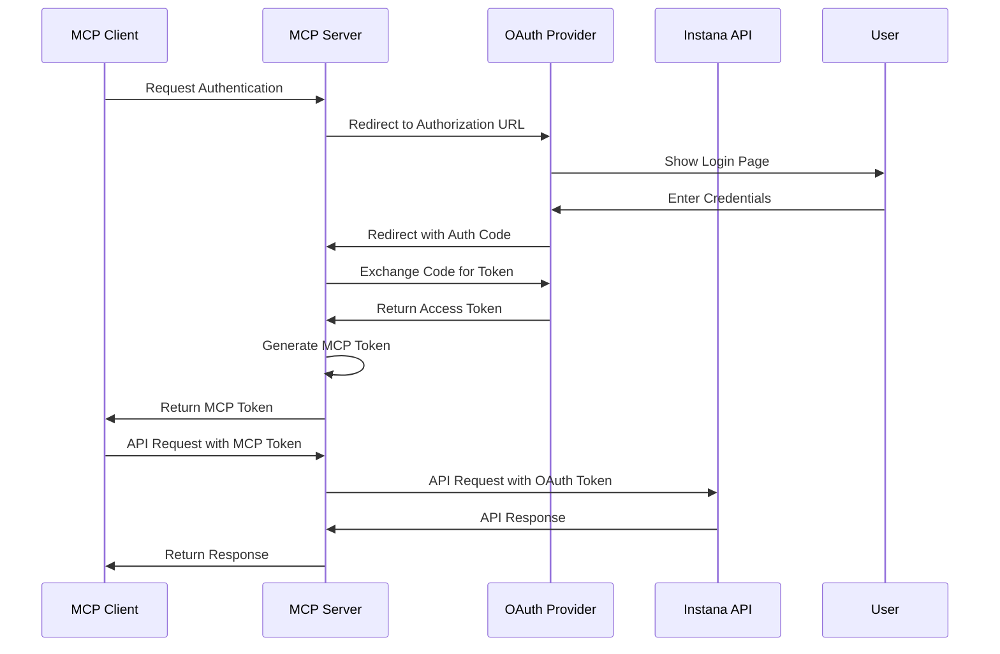

# OAuth Setup Guide for MCP Instana

This guide explains how to configure and use OAuth authentication with the MCP Instana server, similar to the mcp-composer implementation.

## Table of Contents

- [Overview](#overview)
- [OAuth Architecture](#oauth-architecture)
- [Prerequisites](#prerequisites)
- [Configuration](#configuration)
- [OAuth Flow](#oauth-flow)
- [Usage Examples](#usage-examples)
- [Troubleshooting](#troubleshooting)

## Overview

The MCP Instana server now supports OAuth 2.0 authentication, providing a secure way to authenticate users and manage access tokens. This implementation is based on the mcp-composer OAuth handler and includes:

- **OAuth 2.0 Authorization Code Flow**: Standard OAuth flow with PKCE support
- **Token Refresh**: Automatic token refresh using refresh tokens
- **Dynamic Token Management**: Support for various token generation methods (JWT, Basic Auth, IAM)
- **JSESSIONID Support**: Session-based authentication for legacy systems

## OAuth Architecture

```
┌─────────────┐         ┌──────────────┐         ┌─────────────┐
│             │         │              │         │             │
│  MCP Client │◄───────►│  MCP Server  │◄───────►│   OAuth     │
│  (Claude,   │         │  (Instana)   │         │  Provider   │
│   Copilot)  │         │              │         │             │
│             │         │              │         │             │
└─────────────┘         └──────────────┘         └─────────────┘
                               │
                               │
                               ▼
                        ┌──────────────┐
                        │              │
                        │   Instana    │
                        │   Instance   │
                        │              │
                        └──────────────┘
```

## Prerequisites

1. **OAuth Provider**: You need an OAuth 2.0 provider (e.g., IBM w3id, Okta, Auth0, etc.)
2. **OAuth Client Credentials**: Client ID and Client Secret from your OAuth provider
3. **Callback URL**: A registered callback URL in your OAuth provider
4. **Python Dependencies**: The following packages are required:
   - `httpx>=0.27.0`
   - `starlette>=0.37.0`
   - `pydantic>=2.11.7`
   - `python-dotenv>=1.1.0`

## Configuration

### Step 1: Environment Variables

Copy the example OAuth configuration file:

```bash
cp src/core/auth_handler/.env.oauth.example .env
```

Edit the `.env` file with your OAuth provider details:

```bash
# Enable OAuth authentication
ENABLE_OAUTH=true

# Server Configuration
OAUTH_HOST=localhost
OAUTH_PORT=8080
OAUTH_SERVER_URL=http://localhost:8080

# OAuth Callback Configuration
OAUTH_CALLBACK_PATH=http://localhost:8080/auth/callback

# OAuth Client Credentials
OAUTH_CLIENT_ID=your-oauth-client-id
OAUTH_CLIENT_SECRET=your-oauth-client-secret

# OAuth Provider URLs
OAUTH_AUTH_URL=https://your-oauth-provider.com/authorize
OAUTH_TOKEN_URL=https://your-oauth-provider.com/token

# OAuth Scopes
OAUTH_MCP_SCOPE=user
OAUTH_PROVIDER_SCOPE=openid

# Instana Configuration (still required for API calls)
INSTANA_BASE_URL=https://your-instana-instance.instana.io
INSTANA_JWT_TOKEN=your_instana_jwt_token
```

### Step 2: OAuth Provider Configuration

#### For IBM w3id (Example)

```bash
OAUTH_AUTH_URL=https://preprod.login.w3.ibm.com/v1.0/endpoint/default/authorize
OAUTH_TOKEN_URL=https://preprod.login.w3.ibm.com/v1.0/endpoint/default/token
OAUTH_PROVIDER_SCOPE=openid
```

#### For Other Providers

Consult your OAuth provider's documentation for the correct authorization and token URLs.

### Step 3: Register Callback URL

Register the callback URL with your OAuth provider:

```
http://localhost:8080/auth/callback
```

Or for production:

```
https://your-domain.com/auth/callback
```

## OAuth Flow

The OAuth authentication flow works as follows:

1. **Client Initiates**: MCP client requests authentication
2. **Authorization Request**: Server redirects to OAuth provider's authorization URL
3. **User Authentication**: User authenticates with OAuth provider
4. **Callback**: OAuth provider redirects back with authorization code
5. **Token Exchange**: Server exchanges authorization code for access token
6. **MCP Token**: Server generates MCP token and maps it to OAuth token
7. **API Calls**: Client uses MCP token for subsequent API calls



## Usage Examples

### Example 1: Using OAuth with FastMCP

```python
from fastmcp import FastMCP
from src.core.auth_handler.oauth import ServerSettings, SimpleOAuthProvider

# Load OAuth settings from environment
settings = ServerSettings()

# Create OAuth provider
oauth_provider = SimpleOAuthProvider(settings)

# Create FastMCP server with OAuth
server = FastMCP(
    name="Instana MCP Server",
    auth_provider=oauth_provider
)

# Run server
server.run(transport="streamable-http")
```

### Example 2: Using OAuth Refresh Client

```python
from src.core.auth_handler.oauth_handler import OAuthRefreshClient

# Create OAuth client with automatic token refresh
client = OAuthRefreshClient(
    base_url="https://your-instana-instance.instana.io",
    token_url="https://your-oauth-provider.com/token",
    client_id="your-client-id",
    client_secret="your-client-secret",
    refresh_token="your-refresh-token",
    scope="openid"
)

# Make API requests (token refresh is automatic)
response = await client.get("/api/application-monitoring/applications")
```

### Example 3: Using Dynamic Token Client

```python
from src.core.auth_handler.dynamic_token_client import DynamicTokenClient

# Create client with dynamic token management
auth_data = {
    "token_url": "https://your-api.com/token",
    "id": "your-client-id",
    "secret": "your-client-secret",
    "token_gen_auth_method": "basic"
}

client = DynamicTokenClient(
    base_url="https://your-api.com",
    auth_data=auth_data
)

# Make API requests (token management is automatic)
response = await client.get("/api/data")
```

### Example 4: Using JSESSIONID Authentication

```python
from src.core.auth_handler.dynamic_token_manager import DynamicTokenManager

# Create manager for JSESSIONID authentication
manager = DynamicTokenManager(
    base_url="https://your-app.com",
    auth_strategy="jsessionid",
    login_url="/login",
    username="your-username",
    password="your-password"
)

# Get authenticated client
client = await manager.get_authenticated_http_client_for_jsessionid()

# Make authenticated requests
response = await client.get("/api/protected-resource")
```

## Troubleshooting

### Common Issues

#### 1. Missing Environment Variables

**Error**: `Failed to load OAuth settings with prefix 'OAUTH_'. Missing required environment variables`

**Solution**: Ensure all required OAuth environment variables are set in your `.env` file.

#### 2. Invalid Callback URL

**Error**: `Invalid state parameter` or `Failed to exchange code for token`

**Solution**: 
- Verify the callback URL is correctly registered with your OAuth provider
- Ensure `OAUTH_CALLBACK_PATH` matches the registered callback URL

#### 3. Token Refresh Failures

**Error**: `Failed to refresh OAuth access token`

**Solution**:
- Check that your refresh token is valid and not expired
- Verify OAuth provider URLs are correct
- Ensure client credentials are valid

#### 4. CORS Issues

**Error**: CORS policy blocking requests

**Solution**:
- Configure your OAuth provider to allow requests from your server's origin
- For development, you may need to disable CORS checks (not recommended for production)

### Debug Mode

Enable debug logging to troubleshoot OAuth issues:

```bash
# Start server with debug logging
mcp-instana --transport streamable-http --debug
```

Or set log level in code:

```python
import logging
logging.basicConfig(level=logging.DEBUG)
```

### Testing OAuth Flow

Test the OAuth flow using curl:

```bash
# 1. Get authorization URL
curl -X POST http://localhost:8080/mcp/auth/authorize \
  -H "Content-Type: application/json" \
  -d '{"client_id": "your-client-id", "redirect_uri": "http://localhost:8080/auth/callback"}'

# 2. Visit the authorization URL in a browser and complete authentication

# 3. Exchange authorization code for token
curl -X POST http://localhost:8080/mcp/auth/token \
  -H "Content-Type: application/json" \
  -d '{"code": "authorization-code", "client_id": "your-client-id"}'
```

## Security Best Practices

1. **Never commit credentials**: Keep `.env` file out of version control
2. **Use HTTPS in production**: Always use HTTPS for OAuth callbacks
3. **Rotate secrets regularly**: Periodically rotate client secrets and refresh tokens
4. **Limit token scope**: Request only the minimum required OAuth scopes
5. **Validate tokens**: Always validate tokens before using them
6. **Use short-lived tokens**: Configure short expiration times for access tokens
7. **Secure storage**: Store refresh tokens securely (encrypted at rest)

## Additional Resources

- [OAuth 2.0 Specification](https://oauth.net/2/)
- [PKCE Extension](https://oauth.net/2/pkce/)
- [MCP Authentication Specification](https://modelcontextprotocol.io/specification/2025-06-18/basic/authentication)
- [FastMCP Documentation](https://github.com/jlowin/fastmcp)

## Support

For issues or questions:
- Open an issue on GitHub
- Check existing documentation
- Review mcp-composer implementation for reference